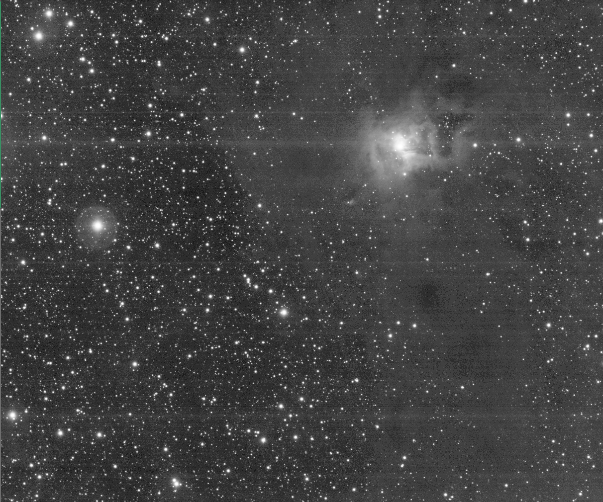
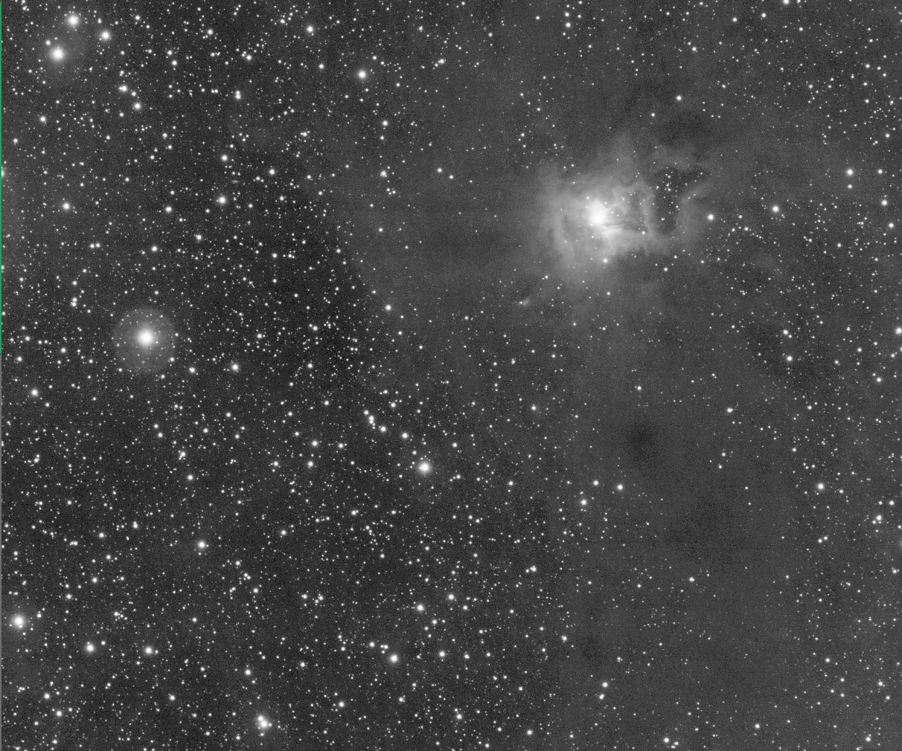

# pixinsight-rowbandingcompensation

PixInsight PJSR resource package for conservative horizontal row-banding compensation on linear monochrome subframes whose residual banding is still aligned with image rows.

This script was designed and implemented to fix the banding on the Atik camera Horizon II, introduced by high gain and saturated stars. The symptom is very similar to Canon banding, for which script CanonBandingReduction was designed, with slightly different causes.

The algorithm corrects strictly horizontal lines whose mean luminosity is offset by the presence of a saturated or nearly saturated star on that same line. It will not give satisfactory results on images that were rotated, even very slightly, by a registration process or following an integration process of frames with an angle offset.

The algorithm attempts to detect nebulosities, gradients and reflexion halos in order to estimate each row luminosity as precisely as possible in the context of the banding effect. It then proceeds iteratively with bounded corrections to balance speed and effect.

<table>
  <tr>
    <th>With visible banding</th>
    <th>After compensation</th>
  </tr>
  <tr>
    <td align="center" width="50%">
      
       
      (CC-BY-SA E.Dejouhanet)
    </td>
    <td align="center" width="50%">
      
       
      (CC-BY-SA E.Dejouhanet)
    </td>
  </tr>
</table>

This second frame was obtained with default settings, with a convergence limit set to 1e-9, leading to 80 iterations. The process took 2'55" on a MacBook M4 Pro 48GB.

The full algorithm is presented in [SPECS.md](./SPECS.md), and its implementation as a PJSR resource developed with GPT-5.4.

The implementation is certainly not exempt of bugs and probably not suited for subframe patching yet. However, because this would be a CosmeticCorrection of choice in a batch script such as WBPP for gain 30 on the Atik Horizon II, a future version will probably implement the algorithm as a process module.

## What is implemented

`RowBandingCompensation` is implemented as a PixInsight JavaScript Runtime package under [`src/scripts/RowBandingCompensation`](src/scripts/RowBandingCompensation).

It includes:

- A process-like script entry point with process-instance export support
- A collapsible dialog covering the parameters described in `SPECS.md`
- Modular engine code for mask preparation, star influence, row profiling, confidence weighting, iterative correction and diagnostics
- Diagnostic view export for the main intermediate profiles and images

## Important integration note

This repository now contains a PJSR script package, not a native compiled PixInsight module.

That means:

- It is suitable for a PixInsight resource repository on GitHub
- It can be code-signed with PixInsight's script signing system
- It can create reusable process instances and run on a view target
- It does not literally register under the native `Process` menu without a C++ module

The script is exposed through `#feature-id` under `Utilities > RowBandingCompensation`.

## Repository layout

The implementation lives in:

- [`src/scripts/RowBandingCompensation/RowBandingCompensation.js`](src/scripts/RowBandingCompensation/RowBandingCompensation.js)
- [`src/scripts/RowBandingCompensation/RowBandingCompensationDialog.js`](src/scripts/RowBandingCompensation/RowBandingCompensationDialog.js)
- [`src/scripts/RowBandingCompensation/RowBandingCompensationEngine.js`](src/scripts/RowBandingCompensation/RowBandingCompensationEngine.js)
- [`src/scripts/RowBandingCompensation/RowBandingCompensationMasks.js`](src/scripts/RowBandingCompensation/RowBandingCompensationMasks.js)
- [`src/scripts/RowBandingCompensation/RowBandingCompensationStars.js`](src/scripts/RowBandingCompensation/RowBandingCompensationStars.js)
- [`src/scripts/RowBandingCompensation/RowBandingCompensationProfiles.js`](src/scripts/RowBandingCompensation/RowBandingCompensationProfiles.js)
- [`src/scripts/RowBandingCompensation/RowBandingCompensationDiagnostics.js`](src/scripts/RowBandingCompensation/RowBandingCompensationDiagnostics.js)
- [`src/scripts/RowBandingCompensation/RowBandingCompensationParameters.js`](src/scripts/RowBandingCompensation/RowBandingCompensationParameters.js)

## Usage

Install the repository as a PixInsight resource repository, then run the script from its feature entry.

Additional workflow documentation is available under [`doc/`](doc/README.md).

Recommended input:

- Linear monochrome subframes
- Preferably calibrated and not yet registered
- Sensor row orientation preserved
- Residual banding still visually horizontal in the image
- Optional external star mask or stars-only image

Current v1 limitations:

- Monochrome only
- Horizontal corrections only
- No preview-target execution (make your preview a standalone image)
- No support yet for slight post-stacking row tilt or other rotated row geometry
- No automatic star extraction when no external star support image is provided
- No native process-module registration under the `Process` menu

If registration or stacking leaves the row defect slightly tilted, do not expect reliable correction from the current implementation. Tilt handling is intentionally deferred until a more robust global geometry method is designed.

## Compatibility Probe

To inspect the actual PJSR widget methods available on your PixInsight build, run:

`/Users/tallfurryman/Documents/Sources/pixinsight-rowbandingcompensation/src/scripts/PJSRCompatibilityProbe/PJSRCompatibilityProbe.js`

Run it from the PixInsight Script Editor or from the application command line with the script-running syntax supported by your installed PixInsight build.

The script prints a console report for `Dialog`, `Control`, `ToolButton`, `PushButton`, `ViewList`, `NumericControl`, `SectionBar`, `Label`, and `ComboBox`.
