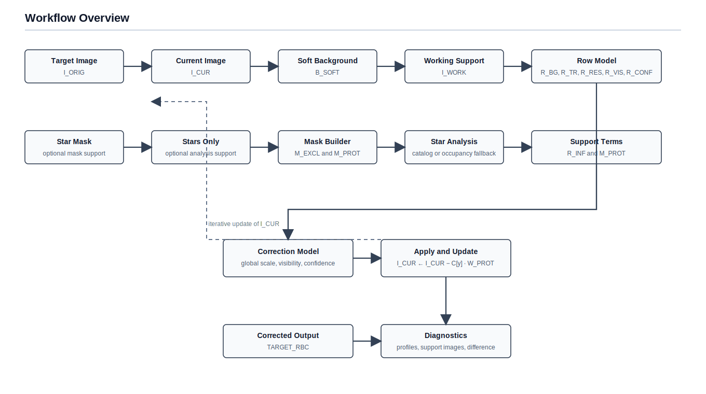
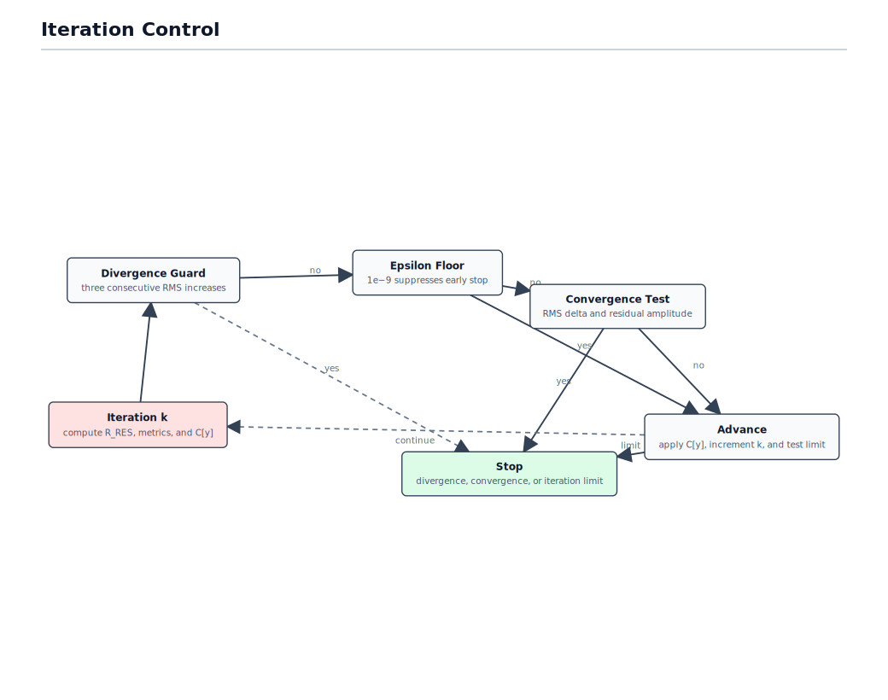

# RowBandingCompensation Workflow

## Introduction

This document describes the implemented v1 workflow of `RowBandingCompensation` as a row-domain correction process for linear monochrome images whose residual banding remains horizontal in image coordinates. The process is iterative, conservative, and diagnostic-oriented: all principal intermediate products are available either as exported views or as logged scalar metrics.

## Notation

| Symbol | Meaning |
| --- | --- |
| `I_ORIG(x,y)` | original target image |
| `I_CUR(x,y)` | current iterative image state |
| `I_MASK(x,y)` | external mask source chosen from `starMaskView` or `starsOnlyView` |
| `M_EXCL(x,y)` | exclusion mask used during row measurement |
| `M_PROT(x,y)` | protection mask used during correction application |
| `B_SOFT(x,y)` | soft 2D background support model |
| `I_WORK(x,y)` | support image used for row measurement when background preconditioning is enabled |
| `R_BG[y]` | robust row background profile |
| `R_TR[y]` | smoothed row trend |
| `R_RES[y]` | row residual profile |
| `R_INF[y]` | normalized star-influence profile |
| `R_VIS[y]` | normalized row-visibility profile |
| `R_CONF[y]` | row-confidence profile |
| `C[y]` | final row correction for one iteration |

## Global Sequence

<!--
D3 source:
const data = await d3.json("./diagram-data/pipeline_overview.json");
const svg = d3.create("svg").attr("viewBox", `0 0 ${data.width} ${data.height}`);
renderDiagram(svg, data);
-->

The iterative state is initialized as `I_CUR = I_ORIG`. Each iteration derives the row-domain model from `I_CUR`, applies the computed correction back to `I_CUR`, then reevaluates convergence and divergence criteria.

## 1. Support Inputs And Masks

The process accepts a target image and up to two external support images.

- If both `starMaskView` and `starsOnlyView` are provided, the star mask builds `M_EXCL` and `M_PROT`, while the stars-only image is used for star analysis.
- If only `starsOnlyView` is provided, it is thresholded internally to derive both masks and also used for star analysis.
- If only `starMaskView` is provided, it supplies both the masks and the star-analysis image.
- If no support image is provided, star-dependent stages are disabled and `R_INF` remains flat zero.

<!--
LaTeX source:
\[
\begin{aligned}
M_{\mathrm{excl}} &= \mathrm{Dilate}\!\left( \mathrm{Thresh}(I_{\mathrm{mask}}) \right), \\
M_{\mathrm{prot}} &= \mathrm{Blur}(I_{\mathrm{mask}}), \\
R_{\mathrm{inf}}[y] &= \mathrm{Norm}\!\left( \sum_k A_k\,K\!\left(\lvert y-y_k\rvert\right) \right), \\
R_{\mathrm{inf,fallback}}[y] &= \mathrm{Norm}\!\left( \mathrm{Mean}_x M_{\mathrm{prot}}(x,y) \right).
\end{aligned}
\]
-->
$$
\begin{aligned}
M_{\mathrm{excl}} &= \mathrm{Dilate}\!\left( \mathrm{Thresh}(I_{\mathrm{mask}}) \right), \\
M_{\mathrm{prot}} &= \mathrm{Blur}(I_{\mathrm{mask}}), \\
R_{\mathrm{inf}}[y] &= \mathrm{Norm}\!\left( \sum_k A_k\,K\!\left(\lvert y-y_k\rvert\right) \right), \\
R_{\mathrm{inf,fallback}}[y] &= \mathrm{Norm}\!\left( \mathrm{Mean}_x M_{\mathrm{prot}}(x,y) \right).
\end{aligned}
$$

`M_EXCL` is the hard measurement mask. It is obtained from the selected support image by thresholding and optional dilation. `M_PROT` is the soft attenuation mask used during correction application. It is obtained from the same support image by blur and truncation to the normalized interval.

For star analysis, the script uses PixInsight's `StarDetector`, then measures each retained object by centroid, area, peak, flux, saturation ratio, and effective radius. A weighted score is assigned to each star and spread vertically through the selected kernel. If no stars survive filtering but a support image exists, the fallback influence profile is the row-wise mean occupancy of `M_PROT`.

## 2. Soft Background Support Model

The soft background model is not a background-correction output. It is an internal stabilizer for row measurement.

<!--
LaTeX source:
\[
\begin{aligned}
B_{\mathrm{soft}}(x,y) &= \mathrm{Bilerp}\!\left( G_\sigma\!\left( \mathrm{Nodes}(I_{\mathrm{cur}}, M_{\mathrm{excl}}) \right) \right), \\
I_{\mathrm{work}}(x,y) &= I_{\mathrm{cur}}(x,y) - B_{\mathrm{soft}}(x,y).
\end{aligned}
\]
-->
$$
\begin{aligned}
B_{\mathrm{soft}}(x,y) &= \mathrm{Bilerp}\!\left( G_\sigma\!\left( \mathrm{Nodes}(I_{\mathrm{cur}}, M_{\mathrm{excl}}) \right) \right), \\
I_{\mathrm{work}}(x,y) &= I_{\mathrm{cur}}(x,y) - B_{\mathrm{soft}}(x,y).
\end{aligned}
$$

The implementation samples `I_CUR` on a coarse node lattice while ignoring masked pixels, accumulates each sample to neighboring lattice nodes with bilinear weights, fills unresolved nodes from local neighbors, applies separable Gaussian smoothing, and reconstructs the support surface by bilinear interpolation. When enabled, row estimation is performed on `I_WORK = I_CUR - B_SOFT`; otherwise it is performed directly on `I_CUR`.

The model is intentionally low-frequency. It should follow broad gradients, not row banding itself.

## 3. Row Profile Construction

The row-domain signal is measured on one row at a time after masking and, optionally, soft-background subtraction.

<!--
LaTeX source:
\[
\begin{aligned}
R_{\mathrm{bg}}[y] &= T_x\!\left( I_{\mathrm{work}}(x,y)\ \middle|\ M_{\mathrm{excl}}(x,y)=0 \right), \\
R_{\mathrm{tr}}[y] &= G_\sigma(R_{\mathrm{bg}})[y], \\
R_{\mathrm{res}}[y] &= R_{\mathrm{bg}}[y] - R_{\mathrm{tr}}[y].
\end{aligned}
\]
-->
$$
\begin{aligned}
R_{\mathrm{bg}}[y] &= T_x\!\left( I_{\mathrm{work}}(x,y)\ \middle|\ M_{\mathrm{excl}}(x,y)=0 \right), \\
R_{\mathrm{tr}}[y] &= G_\sigma(R_{\mathrm{bg}})[y], \\
R_{\mathrm{res}}[y] &= R_{\mathrm{bg}}[y] - R_{\mathrm{tr}}[y].
\end{aligned}
$$

For each row `y`, the script gathers all unmasked samples along `x` and estimates a robust location with one of three estimators: median, trimmed mean, or winsorized mean. If a row has no valid samples, its row background value is interpolated from neighboring valid rows. If a row has some valid samples but does not meet `minimumValidPixelsPerRow`, its direct estimate is retained but its later confidence is reduced.

`R_TR` is the conservative low-frequency baseline obtained by 1D Gaussian smoothing of `R_BG`. The residual `R_RES = R_BG - R_TR` is the principal 1D banding signal used by the rest of the workflow.

Two auxiliary profiles are then derived:

- `R_VIS`, a normalized visibility estimate computed from `R_RES` with one of four implemented modes: `HighPassResidual`, `FirstDerivative`, `SecondDerivative`, or `LocalMAD`.
- `R_CONF`, a confidence estimate based on valid-sample fraction, direct-vs-interpolated status, and a modest penalty in rows with strong star influence.

## 4. Correction Synthesis And Application

The correction model is multiplicative around the residual row signal. Modulation terms do not create a correction independently; they only scale the residual-driven base term.

<!--
LaTeX source:
\[
\begin{aligned}
Q[y] &= \max\!\left(0,\ 1 - c_{\mathrm{conf}}\,(1 - R_{\mathrm{conf}}[y])\right), \\
W_{\mathrm{prot}}(x,y) &= 1 - s_{\mathrm{prot}}\,\mathrm{clamp}\!\left(M_{\mathrm{prot}}(x,y), 0, 1\right), \\
C[y] &= \mathrm{clip}\!\Bigl(
g\,R_{\mathrm{res}}[y]\,
\bigl(1 + b_{\star}R_{\mathrm{inf}}[y]\bigr)\,
\bigl(1 + b_{\mathrm{vis}}R_{\mathrm{vis}}[y]\bigr)\,
Q[y]
\Bigr), \\
I_{\mathrm{next}}(x,y) &= \mathrm{clip}\!\left(
I_{\mathrm{cur}}(x,y) - C[y]\;W_{\mathrm{prot}}(x,y)
\right).
\end{aligned}
\]
-->
$$
\begin{aligned}
Q[y] &= \max\!\left(0,\ 1 - c_{\mathrm{conf}}\,(1 - R_{\mathrm{conf}}[y])\right), \\
W_{\mathrm{prot}}(x,y) &= 1 - s_{\mathrm{prot}}\,\mathrm{clamp}\!\left(M_{\mathrm{prot}}(x,y), 0, 1\right), \\
C[y] &= \mathrm{clip}\!\Bigl(
g\,R_{\mathrm{res}}[y]\,
\bigl(1 + b_{\star}R_{\mathrm{inf}}[y]\bigr)\,
\bigl(1 + b_{\mathrm{vis}}R_{\mathrm{vis}}[y]\bigr)\,
Q[y]
\Bigr), \\
I_{\mathrm{next}}(x,y) &= \mathrm{clip}\!\left(
I_{\mathrm{cur}}(x,y) - C[y]\;W_{\mathrm{prot}}(x,y)
\right).
\end{aligned}
$$

The implemented correction uses:

- a global residual scale `globalStrength`,
- optional star-weight modulation through `R_INF`,
- optional salience modulation through `R_VIS`,
- optional confidence attenuation through `R_CONF`,
- an absolute per-iteration cap `maximumPerIterationCorrection`.

Application is performed directly on `I_CUR`, not on the soft-background-subtracted support image. If protection is enabled, the per-pixel correction is attenuated by `M_PROT`. The attenuation weight is near unity on background and smaller near masked stars or halos. The selected clipping policy is applied immediately after subtraction.

## 5. Iteration Control

<!--
LaTeX source:
\[
\begin{aligned}
\Delta_{\mathrm{rms}} &= \mathrm{RMS}(R_{\mathrm{res}}^{(k)} - R_{\mathrm{res}}^{(k-1)}), \\
q_{95} &= Q_{0.95}\!\left(\lvert R_{\mathrm{res}}^{(k)} \rvert\right), \\
\text{stop} &\iff
\bigl(\Delta_{\mathrm{rms}} \le \varepsilon \land q_{95} \le \varepsilon \bigr)
\ \lor\
\bigl(\max \lvert C^{(k)} \rvert \le \varepsilon \land q_{95} \le \varepsilon \bigr).
\end{aligned}
\]
-->
$$
\begin{aligned}
\Delta_{\mathrm{rms}} &= \mathrm{RMS}(R_{\mathrm{res}}^{(k)} - R_{\mathrm{res}}^{(k-1)}), \\
q_{95} &= Q_{0.95}\!\left(\lvert R_{\mathrm{res}}^{(k)} \rvert\right), \\
\text{stop} &\iff
\bigl(\Delta_{\mathrm{rms}} \le \varepsilon \land q_{95} \le \varepsilon \bigr)
\ \lor\
\bigl(\max \lvert C^{(k)} \rvert \le \varepsilon \land q_{95} \le \varepsilon \bigr).
\end{aligned}
$$

<!--
D3 source:
const data = await d3.json("./diagram-data/convergence_logic.json");
const svg = d3.create("svg").attr("viewBox", `0 0 ${data.width} ${data.height}`);
renderDiagram(svg, data);
-->

Each iteration reports:

- residual RMS,
- residual robust sigma,
- residual `|95%|` amplitude,
- maximum correction amplitude,
- residual RMS change relative to the previous iteration.

The current implementation stops early only when the remaining residual is small in amplitude as well as stable between iterations. This is stricter than a pure RMS-change criterion and better matches visible residual banding.

The special floor case is deliberate: when `convergenceEpsilon = 1e-9` on the current 32-bit path, early convergence is suppressed and the run proceeds until the configured iteration limit or a divergence stop.

The divergence guard is also explicit. If residual RMS increases in three successive iterations, the script stops and advises reduction of `globalStrength` and/or `maximumPerIterationCorrection`.

## 6. Reading The Logs And Diagnostic Products

The most useful workflow diagnostics are:

- `rowResidual`: primary 1D banding signal; this is the best convergence trace.
- `rowCorrection`: actual signed correction sent to the image.
- `differenceImage = corrected - original`: spatial localization of all applied changes.
- `softBackgroundModel`: verification that the support surface remains low-frequency.
- `workingImage`: verification that broad gradients were reduced without imprinting lattice artifacts.

The plot views are exported as vertical strips so that the row axis coincides with the image row axis. `rowInfluence` and `rowConfidence` are rendered on a fixed `[0,1]` scale. `rowResidual` and `rowVisibility` are rendered as bars to improve visibility at ordinary zoom levels.

Operationally, the log should be interpreted together with a stretched inspection of the corrected frame:

- If residual metrics decrease while the stretched image still shows faint horizontal structure, the process is converging but has not yet reached a visually satisfactory residual floor.
- If `Residual |95%| amplitude` remains materially above the desired banding floor, lowering `convergenceEpsilon` or increasing the allowed iteration count is preferable to making a single pass more aggressive.
- If residual RMS rises sequentially, the model is beginning to diverge even if some corrected rows still look plausible by eye.

## 7. PIDoc Migration Note

The present document is intentionally structured so that a future PIDoc conversion can map sections almost directly:

- scope and limitations,
- mathematical formulation,
- parameterized processing stages,
- convergence and stability criteria,
- diagnostics and interpretation.

The largest future delta is packaging, not algorithm description: the current implementation is a PJSR resource package, while the eventual performance-oriented target would be a native PixInsight process module.
